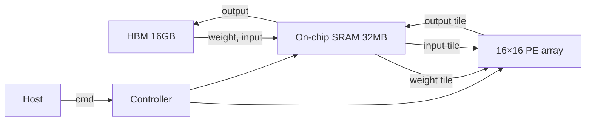

# 3-1. NPU 구조 설계 — 베팅을 정하고 블록 다이어그램 그리기

**소요 시간:** 4시간
**방식:** 분석 + 설계 (이론 25%, 설계 75%)
**선수:** Week 1 + Week 2 전체 완료

---

## 학습 목표

- Week 2-5에서 분석한 칩들의 패턴을 종합해 **본인의 NPU가 무엇에 베팅할지** 결정한다.
- *Defining architectural feature* 한 가지를 선언하고 그 결정의 trade-off를 문서화한다.
- NPU의 블록 다이어그램과 파라미터 config를 작성한다.
- 이 설계가 Week 3 후반부 (3-2 ~ 3-5) 의 시뮬레이터에서 *시험대*에 오른다.

## Week 2와의 연결

Week 2-5: 학생은 *남이 만든* 칩 1종을 분석했다.
Week 3-1: 학생은 *본인이 만들* 칩의 *받는 쪽이 아니라 주는 쪽*이 된다.

> 이번 회차는 코드를 거의 안 씁니다. **결정** 자체가 산출물입니다.

## 산출물

- `week3/lab/01_npu_config.py` — NPU 파라미터를 담은 dataclass / dict
- `week3/docs/npu_design.md` — defining feature, 블록 다이어그램, trade-off 문서
- 프롬프트 로그 1블록 (설계 의사결정 과정)

---

## Part A. 좋은 NPU의 특징 — Week 2 패턴 종합 (45분)

### 4가지 흔한 베팅 패턴

Week 2-5의 칩들은 결국 다음 4가지 axis 중 *한 곳에 집중* 했다.

| 베팅 axis | 대표 칩 | 핵심 결정 |
| --- | --- | --- |
| **정밀도 (dtype)** | Apple NE, Mythic | INT8 / 4 / analog 으로 lane 밀도 극대화 |
| **데이터 이동** | Cerebras, Graphcore | on-chip SRAM을 거대하게 → DRAM trip 제거 |
| **결정론 / 컴파일러** | Groq | 컴파일러가 모든 사이클을 정함, hardware 단순화 |
| **그래프 / 일반성** | Tenstorrent, SambaNova | dataflow graph를 직접 실행, MatMul 외 op도 효율 |

> 좋은 NPU 설계 = *한 axis에 명확하게 베팅*. 모든 axis를 동시에 잡으려고 하면 결국 GPU 비슷하게 됨.

### 토의 질문 (10분)

1. 본인이 분석한 Week 2-5 칩은 어느 axis에 베팅한 칩이었나?
2. *"우리 NPU는 모든 면에서 좋다"* 가 왜 나쁜 답인가?
3. 베팅하지 않은 axis들은 어떻게 처리되는가? (트레이드오프, 호스트 위임, 일부러 약점 인정)

---

## Part B. 본인 NPU의 베팅 정하기 (60분)

### 의사결정 체크리스트

다음 6개 결정을 *명시적으로* 내리고 `npu_design.md`에 기록.

#### 1. Defining feature (1줄)

> 본인 NPU를 한 문장으로 표현. *"우리 NPU는 ___에 베팅했다"*.
> 예: *"우리는 INT8 + 매우 큰 weight 캐시에 베팅했다 — 단일 LLM batch=1 추론을 빠르게."*

#### 2. 정밀도 (dtype)

| 옵션 | lane 밀도 (FP32 대비) | 적합 |
| --- | --- | --- |
| FP32 | 1× | 학습 |
| BF16 / FP16 | 2× | 학습/추론 균형 |
| INT8 | 4× | 추론 (양자화된 모델) |
| INT4 / FP4 | 8× | LLM 추론 |
| Mixed (e.g., INT8 input × FP16 accum) | 4× | 정확도/속도 tradeoff |

> 본인 NPU의 dtype 결정과 *왜 그 선택인가* 한 줄.

#### 3. PE Array 모양

| 옵션 | 특징 | 적합 |
| --- | --- | --- |
| 16×16 systolic | 작은 MatMul도 효율 | 다양한 워크로드 |
| 32×32 systolic | TPU-lite | MatMul 위주 |
| 64×64 systolic | TPU-class | 거대 MatMul |
| 128×128 ×4 (multi-array) | TPU v4-class | 대규모 학습 |
| 1D vector (e.g., 256 lanes) | 더 유연 | conv-heavy |
| Reconfigurable | 가장 유연, hardware 비쌈 | 다양한 op |

#### 4. Dataflow

| 옵션 | 강점 워크로드 |
| --- | --- |
| Weight Stationary | 배치 추론, weight reuse 큼 |
| Output Stationary | depthwise conv, partial sum reuse |
| Input Stationary | spatial conv (input feature reuse) |
| Hybrid (mode switching) | 다양한 op |

#### 5. 메모리 계층

- **On-chip SRAM 크기**: 1 MB / 16 MB / 100 MB / 1 GB? (TPU v4 = ~32MB; Cerebras = 40 GB)
- **DRAM**: HBM (대역폭 큼, 비쌈) / DDR / 없음 (on-chip만)
- **Scratchpad vs Cache**: 자동(GPU-like) vs 수동(TPU-like)?

#### 6. 워크로드 포커스

- **추론 only / 학습 only / 둘 다**
- **타깃 모델 클래스**: CNN / Transformer / RNN / 새로운 것
- **타깃 환경**: 데이터센터 / 엣지 / 모바일 / 자동차

---

## Part C. Config 코드 + 블록 다이어그램 (75분)

### `01_npu_config.py` 작성

학생 과제 (바이브 코딩으로):

> Python dataclass로 NPU 파라미터를 담는 `NPUConfig` 클래스를 만들어라. 필드:
> - `name: str`
> - `defining_feature: str`
> - `dtype: str` ('int8' / 'fp16' / 'bf16' 등)
> - `dtype_bytes: int`
> - `pe_array_rows: int`, `pe_array_cols: int`
> - `dataflow: str` ('WS' / 'OS' / 'IS' / 'hybrid')
> - `clock_ghz: float`
> - `sram_kb: int`
> - `dram_bw_gbps: float` (없으면 0)
> - `target_workload: str`
>
> 위 값들로 *peak_tops*를 계산하는 메서드도 만들 것.

### 블록 다이어그램 (`npu_design.md`에 포함)

다음 5-7개 블록과 화살표를 표현 (손그림 / mermaid / ASCII art 모두 OK):

1. PE array
2. On-chip SRAM (scratchpad)
3. DRAM (있다면)
4. DMA / Memory controller
5. Controller (sequencer)
6. Host I/F
7. (선택) accelerator-specific block (e.g., softmax unit, reshape engine)

> 화살표 라벨에 *"무엇이 이 경로로 흐르는가"* — input activation? weight? partial sum?

### Mermaid 예시 (참고용)

---

## Part D. 회고 & 3-2 예고 (30분)

### 회고 (`week3/docs/retrospective-3-1.md`)

1. 본인 NPU의 *defining feature*는 무엇인가? 한 줄.
2. 일부러 *포기*한 워크로드/성능 axis는 무엇인가? (예: "우리는 학습은 안 함, 추론만")
3. Week 2-5에서 분석한 칩과 본인 NPU의 차이는? *defining feature가 다른가, 같은 axis인데 다른 베팅인가?*

### 3-2 예고

- 3-2: MAC 유닛과 메모리 계층을 *코드로* 구현
- 본인 NPUConfig의 결정값들이 시뮬레이터의 동작에 어떻게 반영되는지 봄

---

## 흔한 막힘 포인트

| 증상 | 원인 | 해결 |
| --- | --- | --- |
| Defining feature가 "AI에 빠르다" 수준 | Week 2-5 막힘 포인트와 동일 | "이 NPU만 갖는 결정"을 한 단어로 |
| 너무 많은 axis에 베팅 | 욕심 | "포기한 것"을 명시 강제 |
| Config 필드를 너무 많이 만듦 | 과설계 | 위 11개 필드만으로 충분, 나머지는 3-2/3-3에서 추가 |
| 블록 다이어그램이 generic AI chip | 본인 NPU의 특징이 그림에 없음 | *defining feature*가 어느 블록의 어떤 속성으로 구현되는지 화살표/주석 |

---

## 평가 체크 (강사용)

- [ ] `NPUConfig` dataclass가 동작하고 `peak_tops` 계산이 합리적
- [ ] `npu_design.md`에 defining feature 1줄, 블록 다이어그램 1장
- [ ] 6개 의사결정 모두 *명시적*으로 기록 (디폴트 값을 그냥 두지 않음)
- [ ] 회고에 *포기한 것* 이 한 줄 이상 적힘
