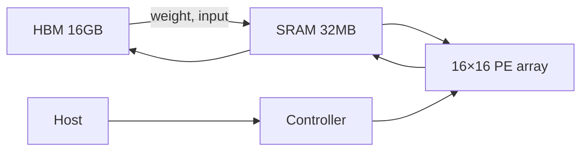

# 3-1. NPU 구조 설계 — 베팅을 정하고 블록 다이어그램

**소요 시간:** 4시간 = 4 × (40분 학습 + 20분 휴식)
**방식:** 분석 + 설계
**선수:** Week 1 + Week 2 전체 완료

---

## 학습 목표

- Week 2-5 칩 패턴을 종합해 **본인 NPU 가 무엇에 베팅할지** 결정
- *Defining architectural feature* 한 가지 선언 + trade-off 문서화
- NPU 블록 다이어그램 + 파라미터 config
- 이 설계가 3-2 ~ 3-5 시뮬레이터에서 *시험대*에 오름

## Week 2 와의 연결

> Week 2-5: *남이 만든* 칩을 분석. Week 3-1: *본인이 만들* 칩 — *받는 쪽이 아니라 주는 쪽*. **결정** 자체가 산출물.

## 산출물

- `week3/lab/01_npu_config.py` — NPUConfig dataclass
- `week3/docs/npu_design.md` — defining feature, 블록 다이어그램, trade-off
- 프롬프트 로그 1 블록

---

## Block 1 — 좋은 NPU 의 4가지 베팅 패턴 (40분)

### Week 2-5 칩들의 axis

| 베팅 axis | 대표 칩 | 핵심 결정 |
| --- | --- | --- |
| **정밀도 (dtype)** | Apple NE, Mythic | INT8/4/analog 으로 lane 밀도 극대화 |
| **데이터 이동** | Cerebras, Graphcore | 거대 on-chip SRAM → DRAM trip 제거 |
| **결정론 / 컴파일러** | Groq | 컴파일러가 모든 사이클 정함, hardware 단순 |
| **그래프 / 일반성** | Tenstorrent, SambaNova | dataflow graph 직접 실행 |

> 좋은 NPU = *한 axis 에 명확히 베팅*. 모두 잡으려 하면 GPU 비슷해짐.

### 토의 (10분)

1. 본인 분석한 Week 2-5 칩은 어느 axis 에 베팅?
2. *"우리 NPU 는 모든 면에서 좋다"* 가 왜 나쁜 답인가?
3. 베팅 *안 한* axis 들은 어떻게 처리? (trade-off, host 위임, 약점 인정)

---

## Block 2 — 본인 NPU 의 6 결정 (40분)

다음 6개를 *명시적으로* `npu_design.md` 에 기록.

### 1. Defining feature (한 줄)

> *"우리 NPU 는 ___ 에 베팅했다"*. 예: *"INT8 + 큰 weight 캐시 — 단일 LLM batch=1 추론을 빠르게."*

### 2. 정밀도

| 옵션 | lane 밀도 (FP32 대비) | 적합 |
| --- | --- | --- |
| FP32 | 1× | 학습 |
| BF16/FP16 | 2× | 학습/추론 균형 |
| INT8 | 4× | 추론 (양자화) |
| INT4/FP4 | 8× | LLM 추론 |

### 3. PE Array 모양

| 옵션 | 적합 |
| --- | --- |
| 16×16 systolic | 다양한 워크로드 |
| 32×32 / 64×64 | TPU-class MatMul |
| 128×128 ×4 | 대규모 학습 |
| 1D vector (256 lanes) | conv-heavy |

### 4. Dataflow

WS / OS / IS / Hybrid

### 5. 메모리 계층

- On-chip SRAM 크기 (1MB / 16MB / 100MB / 1GB)
- DRAM (HBM / DDR / 없음)
- Scratchpad vs Cache

### 6. 워크로드 포커스

- 추론 / 학습 / 둘 다
- 타깃 모델 (CNN / Transformer / RNN)
- 환경 (데이터센터 / 엣지 / 모바일)

---

## Block 3 — Config 코드 + 블록 다이어그램 (40분)

### `01_npu_config.py` 작성 (바이브 코딩)

> Python dataclass `NPUConfig` 작성. 필드: `name`, `defining_feature`, `dtype`, `dtype_bytes`, `pe_array_rows/cols`, `dataflow`, `clock_ghz`, `sram_kb`, `dram_bw_gbps`, `target_workload`. `peak_tops` 계산 메서드.

### 블록 다이어그램 (5-7 블록)

1. PE array
2. On-chip SRAM
3. DRAM (있다면)
4. DMA / Memory controller
5. Controller (sequencer)
6. Host I/F
7. (선택) accelerator-specific (softmax, reshape)

> 화살표 라벨에 *무엇이 흐르는가* — input activation / weight / partial sum
> 손그림 / mermaid / ASCII 모두 OK

> **3-2 예고**: 위 블록 다이어그램의 각 모듈은 `week3/reference/02_mac_verilog/` 의 `.v` 파일과 1:1 매핑됩니다 — 본인 다이어그램이 *RTL 모듈 경계* 를 미리 정의.

### Mermaid 예시

---

## Block 4 — 회고 + 3-2 예고 (40분)

### 회고 (`week3/docs/retrospective-3-1.md`)

1. 본인 NPU 의 *defining feature* 한 줄
2. 일부러 *포기* 한 axis 는? (예: *"학습 안 함, 추론만"*)
3. Week 2-5 분석 칩과 본인 NPU 의 차이? (axis 자체가 다른가, 같은 axis 다른 베팅?)

### 3-2 예고

- 3-2: MAC 유닛 + 메모리 계층을 *코드로*
- Python `MACUnit` 클래스 + **Verilog `mac.v` + cocotb** (anchor)
- 본인 NPUConfig 결정값이 시뮬에 반영

---

## 흔한 막힘 포인트

| 증상 | 원인 | 해결 |
| --- | --- | --- |
| Defining feature 가 *"AI 에 빠르다"* | Week 2-5 와 동일 | *"이 NPU 만 갖는 결정"* 한 단어로 |
| 너무 많은 axis 에 베팅 | 욕심 | *포기한 것* 명시 강제 |
| Config 필드 너무 많음 | 과설계 | 위 10 필드만, 나머지는 3-2/3-3 에서 |
| 블록 다이어그램이 generic AI chip | defining feature 가 그림에 없음 | *어느 블록 / 어느 속성*에 구현되는지 화살표/주석 |

---

## 평가 체크 (강사용)

- [ ] `NPUConfig` dataclass 동작 + `peak_tops` 합리적
- [ ] `npu_design.md` 에 defining feature 1줄 + 블록 다이어그램 1장
- [ ] 6개 결정 모두 *명시적* 기록 (default 그냥 두지 않음)
- [ ] 회고에 *포기한 것* 한 줄 이상
